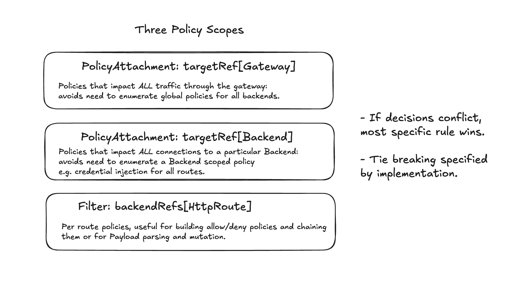
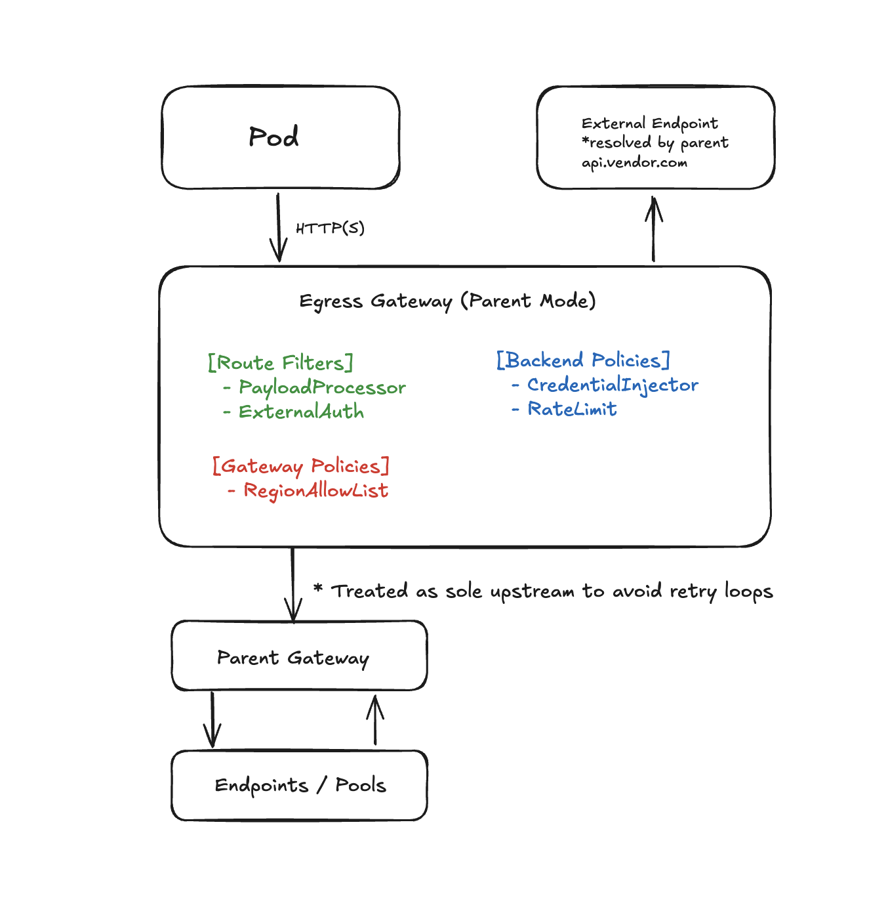

# AI Gateway User Stories Draft

Below I have a hypothetical architecture for an Egress Gateway which allows for network policies at three different scopes: Gateway (global), Backend (per FQDN), Route (per HTTP/GRPCRoute).

## Proposed High Level Implementation

The proposal reuses existing Gateway API primitives (Gateway, HTTPRoute, GRPCRoute) and introduces a Backend resource derived from [this proposal](https://docs.google.com/document/d/1QLJ_X99VfTgRCzwAaoBzsBq_u4anxT2N5kjlCSJNROc/edit?tab=t.0#heading=h.luxzkmb8apq4)
for representing external destinations and cross-cluster endpoints.

The diff for my proposal is [here](https://github.com/kubernetes-sigs/wg-ai-gateway/pull/16).

Two networking modes are available: **Endpoint** and **Parent**. In Endpoint mode the gateway connects directly to requested resources. In Parent mode it
treats another gateway as its sole upstream.

## Policy Pattern summary

| Policy Layer | Example CRDs / Patterns                                                                | Typical Use                                              |
| ------------ | -------------------------------------------------------------------------------------- | -------------------------------------------------------- |
| **Gateway**  | `GuardRailsPolicy`, `RegionAllowListPolicy`, `ObservabilityPolicy`                     | Org-wide posture: geo restrictions, auditing, deny-lists |
| **Backend**  | `EgressPolicy`, `CredentialInjector`, `BackendTLSPolicy`, `DNSPolicy`, `QoSController` | Per-destination credentials, rate/QoS, DNS, mTLS         |
| **Route**    | `PayloadProcessor`, `ExternalAuth`                                                     | Per-request parsing, redaction, or access filtering      |

## User Stories in this Model

These user stories were taken directly from the AI Gateway Working Group's [egress-gateway proposal](https://github.com/kubernetes-sigs/wg-ai-gateway/blob/main/proposals/10-egress-gateways.md#user-stories).

### **1. Access to external services**

> As a gateway admin I need to provide workloads within my cluster access to services outside of my cluster, in particular cloud and otherwise hosted services.

| Field                      | Value                                                                     |
| -------------------------- | ------------------------------------------------------------------------- |
| **Routing mode**           | Endpoint                                                                  |
| **Route filters**          | Optional `ExternalAuth` (allow/deny)                                      |
| **Backend policies**       | `CredentialInjector`, `BackendTLSPolicy`, optional `RateLimitPolicy`      |
| **Gateway attachments**    | Optional `GuardRailsPolicy`                                               |
| **Example policy objects** | `EgressPolicy`, `BackendTLSPolicy`, `GuardRailsPolicy`                    |
| **Notes**                  | Baseline: HTTPRoute → Backend (FQDN) with credentials and TLS validation. |

---

### **2. Central token management**

> As a gateway admin I need to manage access tokens for 3rd party AI services so workloads can perform inference without managing secrets directly.

| Field                      | Value                                                                   |
| -------------------------- | ----------------------------------------------------------------------- |
| **Routing mode**           | Endpoint                                                                |
| **Route filters**          | —                                                                       |
| **Backend policies**       | `CredentialInjector` (rotating API keys, STS/OIDC), `RateLimitPolicy`   |
| **Gateway attachments**    | —                                                                       |
| **Example policy objects** | `EgressPolicy`, `CredentialInjector`                                    |
| **Notes**                  | Secrets stay centralized; credentials injected dynamically per backend. |

---

### **3. Cloud fail-over**

> As a gateway admin providing token management for 3rd party AI cloud services, I need fail-over between providers when the primary fails.

| Field                      | Value                                                                            |
| -------------------------- | -------------------------------------------------------------------------------- |
| **Routing mode**           | Endpoint                                                                         |
| **Route filters**          | Optional `ExternalAuth` or health filter                                         |
| **Backend policies**       | Multiple `Backend` objects with `RateLimitPolicy`, priority/weight for fail-over |
| **Gateway attachments**    | Optional backoff defaults (`GuardRailsPolicy`)                                   |
| **Example policy objects** | `EgressPolicy`, `QoSController`, `BackendTLSPolicy`                              |
| **Notes**                  | Fail-over handled at backend level; avoids duplicate inference.                  |

---

### **4. Verify external service identity**

> As a gateway admin providing egress routing to external services, I need to verify the identity of the remote service and enforce authentication.

| Field                      | Value                                                            |
| -------------------------- | ---------------------------------------------------------------- |
| **Routing mode**           | Endpoint or Parent                                               |
| **Route filters**          | —                                                                |
| **Backend policies**       | `BackendTLSPolicy` (CA/hostname validation), optional mTLS       |
| **Gateway attachments**    | Optional global TLS settings                                     |
| **Example policy objects** | `BackendTLSPolicy`, `EgressPolicy`                               |
| **Notes**                  | Ensures outbound TLS verification and optional mTLS client auth. |

---

### **5. Verify client to external service**

> As a gateway admin providing egress routing to external services, I need to verify the client identity when connecting to the external service.

| Field                      | Value                                                                   |
| -------------------------- | ----------------------------------------------------------------------- |
| **Routing mode**           | Endpoint or Parent                                                      |
| **Route filters**          | —                                                                       |
| **Backend policies**       | mTLS via `BackendTLSPolicy.clientCertificateRef`                        |
| **Gateway attachments**    | Optional PKI defaults                                                   |
| **Example policy objects** | `BackendTLSPolicy`, `EgressPolicy`                                      |
| **Notes**                  | Gateway acts as TLS client; authenticates with per-backend certificate. |

---

### **6. Manage custom CAs and CRLs**

> As a gateway admin, I need to manage certificate authorities for egress connections, including pinning, intermediates, and CRLs.

| Field                      | Value                                                             |
| -------------------------- | ----------------------------------------------------------------- |
| **Routing mode**           | Endpoint or Parent                                                |
| **Route filters**          | —                                                                 |
| **Backend policies**       | `BackendTLSPolicy` (custom CA bundle, SPKI pins, CRL/OCSP config) |
| **Gateway attachments**    | Optional global CA defaults                                       |
| **Example policy objects** | `BackendTLSPolicy`, `GuardRailsPolicy`                            |
| **Notes**                  | Per-destination trust; centralized CA revocation or pinning.      |

---

### **7. Controlled DNS resolution**

> As a gateway admin providing egress routing to external services, I need to control DNS resolution for these sources and enable reverse DNS checks.

| Field                      | Value                                                          |
| -------------------------- | -------------------------------------------------------------- |
| **Routing mode**           | Endpoint or Parent                                             |
| **Route filters**          | —                                                              |
| **Backend policies**       | `DNSPolicy` (resolver, TTL, reverse-DNS enforcement)           |
| **Gateway attachments**    | Optional global resolver config                                |
| **Example policy objects** | `EgressPolicy`, `DNSPolicy`                                    |
| **Notes**                  | Backend overrides global resolver defaults; secured DNS chain. |

---

### **8. Dedicated inference cluster**

> As a cluster admin I need to provide inference to workloads, but through a dedicated cluster for separation.

| Field                      | Value                                                                   |
| -------------------------- | ----------------------------------------------------------------------- |
| **Routing mode**           | Parent                                                                  |
| **Route filters**          | Optional `ExternalAuth`, `PayloadProcessor`                             |
| **Backend policies**       | Backend = parent gateway; `CredentialInjector`, `BackendTLSPolicy`      |
| **Gateway attachments**    | `GuardRailsPolicy` at parent gateway                                    |
| **Example policy objects** | `EgressPolicy`, `BackendTLSPolicy`, `GuardRailsPolicy`                  |
| **Notes**                  | Local retries only; parent gateway manages pool routing and guardrails. |

---

### **9. Cloud inference access**

> As a cluster admin I need to provide inference access via cloud services (e.g., Vertex, Bedrock) instead of running models locally.

| Field                      | Value                                                            |
| -------------------------- | ---------------------------------------------------------------- |
| **Routing mode**           | Endpoint                                                         |
| **Route filters**          | Optional `PayloadProcessor`                                      |
| **Backend policies**       | `CredentialInjector`, `BackendTLSPolicy`                         |
| **Gateway attachments**    | Optional `RegionAllowList`                                       |
| **Example policy objects** | `EgressPolicy`, `BackendTLSPolicy`, `GuardRailsPolicy`           |
| **Notes**                  | Managed API egress with centralized credential and TLS handling. |

---

### **10. Specialized provider features**

> As a developer building an inference-enabled app, I need access to AI cloud providers offering unique capabilities.

| Field                      | Value                                                            |
| -------------------------- | ---------------------------------------------------------------- |
| **Routing mode**           | Endpoint                                                         |
| **Route filters**          | Optional `PayloadProcessor`, `ExternalAuth`                      |
| **Backend policies**       | Provider-specific headers via `CredentialInjector`, optional QoS |
| **Gateway attachments**    | Optional `ModelDenyList` or `RegionAllowList`                    |
| **Example policy objects** | `EgressPolicy`, `CredentialInjector`, `GuardRailsPolicy`         |
| **Notes**                  | Backend policies abstract provider details and headers.          |

---

### **11. Local-to-cloud fail-over**

> As a developer of an inference-enabled app, I need fail-over from local models to 3rd party providers if local workloads fail.

| Field                      | Value                                                                   |
| -------------------------- | ----------------------------------------------------------------------- |
| **Routing mode**           | Endpoint                                                                |
| **Route filters**          | Optional `PayloadProcessor`                                             |
| **Backend policies**       | Multiple `Backend` targets (local + remote); `Rate/QoS` per destination |
| **Gateway attachments**    | Optional `GuardRailsPolicy` or retry configuration                      |
| **Example policy objects** | `EgressPolicy`, `QoSController`, `BackendTLSPolicy`                     |
| **Notes**                  | Weighted fail-over with clear retry behavior to avoid duplication.      |

---

### **12. Outbound attribution**

> As a platform operator I need to attribute outbound traffic per namespace or workload to enforce rate or utilization limits.

| Field                      | Value                                                                                        |
| -------------------------- | -------------------------------------------------------------------------------------------- |
| **Routing mode**           | Endpoint or Parent                                                                           |
| **Route filters**          | —                                                                                            |
| **Backend policies**       | —                                                                                            |
| **Gateway attachments**    | `ObservabilityPolicy` (metrics, audit)                                                       |
| **Example policy objects** | `ObservabilityPolicy`, `GuardRailsPolicy`                                                    |
| **Notes**                  | Emit metrics tagged by `{gateway, route, backend, ns, sa}`. Enables billing and enforcement. |

---

### **13. Regional compliance**

> As a compliance engineer I need to ensure outbound traffic to third-party AI resources obeys regulatory restrictions like region locks.

| Field                      | Value                                                                 |
| -------------------------- | --------------------------------------------------------------------- |
| **Routing mode**           | Endpoint or Parent                                                    |
| **Route filters**          | —                                                                     |
| **Backend policies**       | Optional metadata tag `region: eu-west`                               |
| **Gateway attachments**    | `RegionAllowListPolicy`                                               |
| **Example policy objects** | `GuardRailsPolicy`, `RegionAllowListPolicy`                           |
| **Notes**                  | Gateway rejects connection if destination not in approved region set. |
