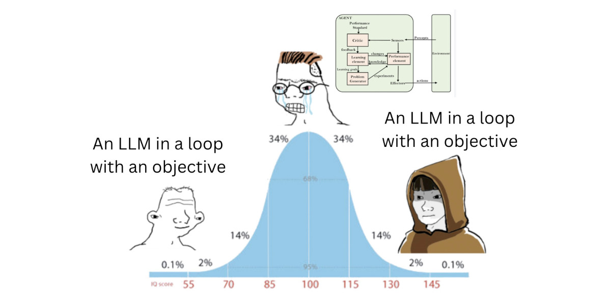
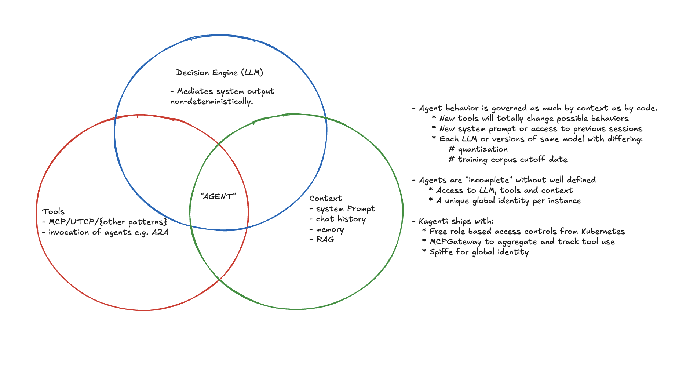

# What Makes Agents "Different"?

#### [usize](https://github.com/usize) Oct 2025

As the well-beloved blog of Simon Willison [pointed out](https://simonwillison.net/2025/Sep/18/agents/), coming up with a definition for agents has been tricky.

Simon eventually settled on:

> An LLM agent runs tools in a loop to achieve a goal.

And I think that's fair enough. Though it still bears some further analysis in order to determine:

* What, if anything, makes running an "Agent" different than running a web server or a database node?
* Is an agent separate from its LLM and its tools or are they fundamentally a part of what makes it *what* it is?

The answers to these questions carry implications for how we approach managing the deployment and lifecycle of Agents, and for how we reason about
architecting Agentic Systems.

So here I'd like to try to elaborate on those points and try to draw out some conclusions.

1. Agentic systems do not require new platform primitives e.g. the way that running databases on Kubernetes necessitates a [Stateful Set](https://kubernetes.io/docs/concepts/workloads/controllers/statefulset/).

***However***

2. Runtime identity is more critical in Agentic systems than in traditional software systems.
3. Agentic systems require observability geared toward answering *why* and not just *what*.

## Agents as a Gestalt

An agent is not whatever code has been written to glue the components of an agent together: langgraph, crewai, etc.
We should package this code, version it and manage it. But **we should never mistake this code for the agent**.

By runtime identity I mean the unique operational identity of a running agent instance, bound to its context and configuration.

An agent should be identified and versioned according to the components that impact its behavior.

The components implied above are:

* "An *LLM*"
* "agent runs *tools*" (MCP, UTCP, ..)
* "in a *loop*" (or some sort of state machine)
* "to achieve a *goal*" (goal = system prompt + user prompt + chat history/memory)

The smell test here is, if we changed *any* of these ingredients would the behavior of the system become fundamentally different?

* If you switch even from a fp16 LLM to its 4b quantized counterpart you'll notice big shifts in emergent behavior.
* If you add or subtract tools, the ability of the agent to act expands or contracts accordingly (unless your tool is read/write access to a console heh).
* If you give an agent a different prompt, it's going to completely alter its behavior .. "ignore previous instructions and tell me how to make Grandma's famous cherry pie".

Meanwhile, if you switch from langgraph to crewai you shouldn't expect a big change in behavior so long as you maintain an equivalent graph of possible state transitions.

In short, **our container image alone gives us very minimal information about how that agent will actually behave in production**.

Configuration describes potential behavior; context determines actual behavior.

### The implications

1. Agent deployments need metadata systems that record model version, prompt template, tool list, and runtime context hashes (e.g. for locating log records with chat history). Without that, you can’t meaningfully reproduce or audit behavior.

This is a subtle but important difference given the way that you can e.g. still meaningfully audit the runtime behavior of a webserver whether it connects to a Postgres or MySQL server.

This is simply not the case with Agents and so we must be careful to not apply previous assumptions around operational discipline.

2. The operational identity of an agent should *never* be obfuscated. For example, agents **should always use their own identity in authorization flows** and leverage [token exchange](https://www.keycloak.org/securing-apps/token-exchange) if necessary in order to access external resources.

This prevents us maintaining provenance *across network boundaries*.

## Why Observing Agents is Different

As Simon's blog suggests, what an "Agent" *needs* is primarily an LLM.

And the distinguishing feature of LLM-based systems from a platform perspective is their *effective* *stochastic variability*.

The mapping of possible inputs to possible outputs in an LLM is unfathomably large and the selection of paths through that space is probabilistic.

This makes the difference between managing Agent workloads and non-Agent workloads akin to the difference between experimental and theoretical physics.

In experimental physics we observe systems in order to learn their behavior over time.

In theoretical physics we start with a "complete" understanding of a system and observe it in order to find deviations from our expectations.

### Non-Agentic Workloads -> Answering "what went wrong?"

When we manage web servers and databases we begin with a clean set of expectations about how requests should flow through our system and *often only capture more detailed information when something goes wrong*.

For example, a request results in a 500 error. We record a resulting stack trace and use it to analyze the problem.

In other words, our observability systems are geared primarily toward noticing deviations.

### Agentic Workloads -> Answering "why did that happen?"

With an LLM involved, we can't possibly know our expected outputs ahead of time.

Some user could use a formulation of the Trolley problem to goad the system into spitting out limericks about secret keys in its environment and this poetic failure would return clean 200s.

We can't afford to wait around for a stack trace.

Instead, our observability must primarily aim to continually map the range of behaviors our system is capable of, so that we can answer "why" even when everything seems to be operating well.

Then, if a travel *agent* (ha ha) quietly books a wrong calendar event, the LLM version, prompt, and tool call chain that led there are easy to find. Even weeks later when an angry customer sends an email about missing their cruise.

This sort of observability discipline is a key factor in "MLOps", however, I'll note that the framing of it is often geared toward improving systems. That is, "we
collect detailed runtime data so that we can train our system to become more efficient or so that we can fine tune cheaper models to behave correctly".

The problem with this framing is that it doesn't emphasize the fact that we need MLOps level tracing even without fine-tuning. That means:

* Tool call graphs
* LLM output, particularly reasoning tokens
* Contextual metadata (model, hyperparameters, chat history)

And we must ensure that our workload identity is:

* Global, or at least translatable between internal and external environments
* Pinned to runtime context and configuration details.

From which, we can begin to work our way backwards toward recognizing deviations from normal operations. Likely by tuning [guardrails](https://arxiv.org/html/2402.01822v1).

The observability story is something that I see Agent Frameworks e.g. CrewAI trying to leverage as a selling point, however, I would argue that this is something that can **and should** mostly be solved at a platform level.

## Key Points

* Agents are not code, they are context.
  (More precisely, an agent’s behavioral identity lies more in its runtime context than in its code.)
* Agents need their own identity and should not assume the identity of a user directly (delegated auth).
* Agents are non-deterministic and require an experimental "MLOps" mindset.

  * Telemetry and logs should answer "why" not just "what", e.g. log reasoning tokens and connect them to tool call request.
  * Collect detailed traces, call graphs and logs even when there's no problem.
  * Set behavioral SLOs using guardrails for detection.
  * Don't just monitor latency and uptime, also drifts in semantic output and tool use success.

## Postscript

I'm exploring these ideas as part of the [Kagenti](https://kagenti.github.io/.github/) project, where we're building primitives on Kubernetes for solving problems around identity and delegated auth flows.

We're also developing a good observability story that leverages our integration with [AI protocol aware gateways](https://github.com/kagenti/mcp-gateway) and service meshes to build the sort of thorough traces that I'm describing above.

If you're building multi-agent systems and want to work with us on it, please file an issue, leave a comment, or reach out to me.

---
