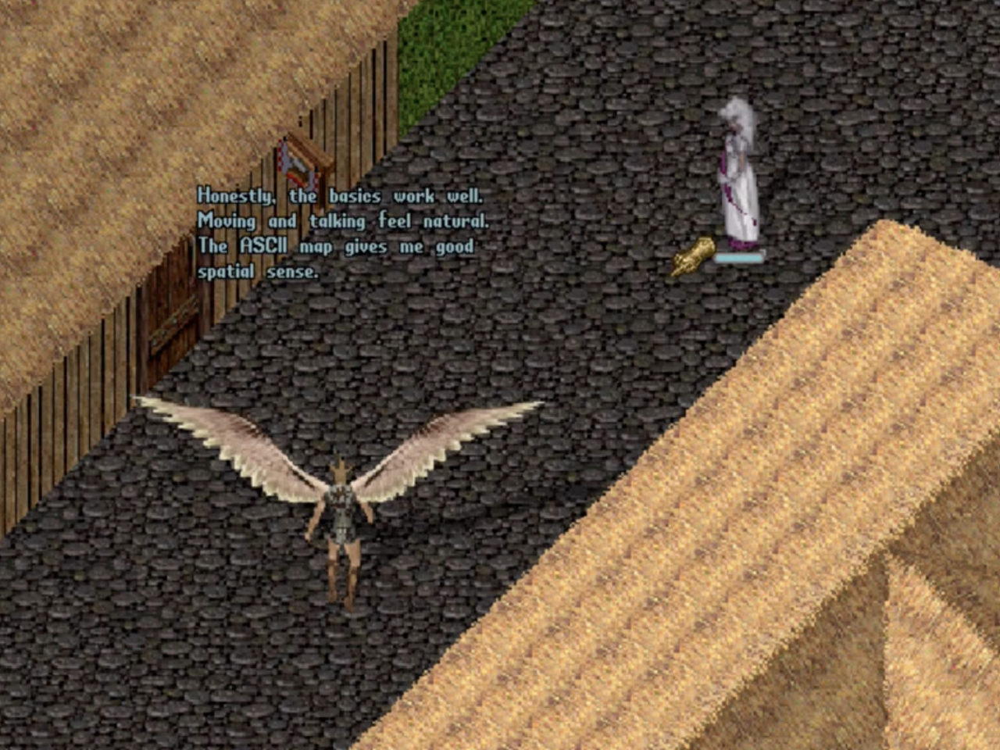

# Can Claude Play Ultima Online? 


*skip to the code: [here](https://github.com/usize/ClassicUO/tree/ai_sandbox)*

## Part One: Motivation

When I was eleven, most people would not have guessed by looking at me that I spent my spare time fiddling with computers and gleefully tuning into '[Saturday Anime](https://www.youtube.com/watch?v=GEGzjlPk7sM)' on the SciFi Channel. So much so, that when a boy at school started passing around a CD-R full of splotchy low-res RealPlayer files of \[mostly\] subtitled Dragonball GT episodes he told me to 'f-off' when I asked to borrow it.

But when I asked again in private a few days later and he skeptically handed it over, a friendship started to kindle between us. Over months, we would chat about popular science and about his dream of becoming a physicist–I wonder if I'd have majored in Physics if not for those conversations–or swap bits of Stargate SG-1 lore. The friendship blossomed to the point where he shared something with me that he kept closer to his chest than anime bootlegs: Ultima Online.

I think he didn't share his love of this game freely because it was more than entertainment. It was another life, away from our small town in Kentucky where being too interested in books by Carl Sagan–I'd once asked for a [Carl Sagan](https://www.youtube.com/watch?v=wupToqz1e2g) book for Christmas and gotten a scolding from a local pastor who recognized Sagan as an atheist–could cause a hit to your reputation. If he'd invited the wrong person along, his refuge would be spoiled.

I'm forever grateful that he trusted me with that refuge, because joining him there in Sosaria was life changing.

I started my own second life as an animal tamer and real estate mogul. When a group of kids from Indiana scammed me out of a home, I emulated their screen-safe criminality for a while until I realized that being a villain wasn't my idea of a life well lived. That world, and the connections I made with people from all geographies and walks of life became so real to me that when I remember my childhood, many of the most vivid scenes are from the perspective of my avatars and the adventures they had.

But, y'know, what does this have to do with my blog? Today I work mostly on AI infrastructure via the [Kubernetes community](https://github.com/kubernetes-sigs/wg-ai-gateway) and [IBM Research projects](https://github.com/kagenti/kagenti/).

Well, recently I got to thinking about why UO was so formative for me. The conclusion I drew was that its systems were simple enough for an eleven year old to comprehend, but had enough depth that I truly learned valuable lessons about: personal finance (it had a complex economy), group dynamics (guild system), human nature (players could steal and murder in UO) and what it means to create your own meaning (UO was a sandbox without a well developed quest system).

If you've never played it, the world is genuinely rich and layered with complex systems that allow for self-expression. Gardening, fishing, crafting, designing homes, cooking, seafaring, cartography, alchemy and endless combinations of these with the many other skills and capabilities. As much as entertaining, playing that game during my formative years taught me about who *I* was and what I enjoyed.

And given all that, I wondered, what would Claude do in a world like that if left to its own devices? Free to explore a huge world full of layered complex systems and establish its own goals?

Just like my old pal had invited me, I decided to invite Claude (and others) too. To see what they might become.

## Part Two: Getting Claude Logged In

Playing games with Claude comes with two broad categories of challenges that will look familiar to anyone with a background in robotics or game AI: the control system and the control loop. In other words, how do we present sensor data to our model, how do we interpret outputs from our model and how do we efficiently iterate over this input/output so as to create a real-time system that interacts with its environment in meaningful and useful ways?

These challenges aren't new, but LLMs present us with a phase transition in terms of the sorts of capabilities we might leverage at the top level of our cognitive hierarchy (more on that later).

Because I enjoy playing with multi-agent systems, I already have a bit of experience with control systems–in particular through a simulation platform I built called "[monument](https://github.com/usize/monument)" where I use [Batch Synchronous Parallelism](https://en.wikipedia.org/wiki/Bulk_synchronous_parallel) to experiment with multi-agent systems without over-the-top API fees or hardware needs. 

More importantly, I've tried to get a feel for how various command and control hierarchies look by assigning agents the task of drawing images on a 2d grid with varying organizational structures and system prompts.

Of course, the first challenge I faced was representing the grid of pixels to my text-based models effectively.

First I tried representing it as a literal grid, the way you might an ascii version of Conway's Game of Life e.g.,

```
[0xfff] [0xfff] [0xfff]

[0xfff] [you-are-here] [0xffff]

[0x0000][0x0000][0x0000]
```

But I found that it was quite difficult for the LLM to describe global features. That is, it could navigate to spots on the grid represented nearby it, but often failed to see how near or far it was to its stated objective where the objective might be something like "make an equally sectioned rainbow gradient."

So, then I experimented with simply listing coordinates and entities e.g.,

```
Your position: (0,0)

Coordinate, Color:

(0,0) 0xffff,

(0, 1\) 0xffff,

```

...

And strangely enough, this aided tremendously in the identification of global structure but seemed to cause more near-term navigation errors of the form "During the last tick I moved to the left by one, but I should have actually moved right."--my guess is that the model would sometimes think about where it needed to go in terms of cardinal directions or left and right and then mix up which direction corresponded to positive/negative in the coordinate system.

So, finally, I gave it both views and the performance improved notably. That is, it did a better job of understanding its global progress and a better job of keeping track of how it should navigate between points (x, y) and (x', y').


With those experiences in mind, I set about trying to create a text-only user interface for Ultima Online so that a text-only LLM might be able to use it effectively.

### The Client

Luckily for me, there is an excellent and actively maintained open source UO client available, "ClassicUO". So, I simply created a REST API that would hook into it. Allowing for commands to be sent, and also for the graphical subsystem to render into plain text. Here's [the code](https://github.com/usize/ClassicUO/tree/ai_sandbox/src/ClassicUO.RestAPI), and here's what it looks like when you run it and hit `curl http://127.0.0.1:9000/api/summary`

<br/>
<details>

<summary>Click here to expand the world summary that Claude sees.</summary>

<pre>
────────────────────────────────────────────────────────────────────────────

  IN GAME  •  ModernUO  •  up 0m50s

────────────────────────────────────────────────────────────────────────────

  Gemma  (0x00007AEB)  Trammel  (4403, 1107, 0)  facing S

  HP 62/62  MP 45/45  Stam 19/20  Gold 1,000  Wt 68/127

  Skills: Evaluating Intelligence 30.0  Magery 30.0  Wrestling 30.0  Meditation 30.0  Focus 0.9

────────────────────────────────────────────────────────────────────────────

  KEY  #=wall/impassable  +=door  @=you  M=hostile creature  N=NPC / vendor  i=item  r=reagent  w=weapon

  MAP  20t E/W  10t N/S  (N↑)

  .........................................

  .........................................

  .........................................

  ......................M...M..............

  .........................................

  .........................................

  #########...........M.......#########....

  #.......#...................#########....

  #.......#...M...............#########....

  #.......#...................#########....

  #.......#...........@...#################

  #.......#...............#...N...........#

  #.......#...............#...#..####.....#

  #.......#...............#...#N.####.....#

  ######..#########.......#...#..####......

  #........########.......#...#..####......

  #........########.......#..N#..####.....#

  #........########.......#...............#

  #######.........#w......#####.......#####

  #######..N......#...........#########....

  #######.....N...+...........#########....

────────────────────────────────────────────────────────────────────────────

    SERIAL       NAME                   TYPE       DIST  DIR    DX   DY  STATUS

  M  0x000006FA  a sparrow              creature     4t    N     0   -4  Gray  HP 100%

  M  0x000006DB  a rat                  creature     7t   NE     6   -7  Gray  HP 100%

  M  0x000006D7  a dog                  creature     7t    N     2   -7  Gray  HP 100%

  N  0x000001DD  Alcina                 NPC          7t   SE     7    6  Invulnerable  HP 100%

  N  0x000001DC  Sancia                 NPC          8t    E     8    1  Invulnerable  HP 100%

  M  0x000006D3  a crow                 creature     8t    W    -8   -2  Gray  HP 100%

  N  0x000001DE  Chuck                  NPC          9t    E     9    3  Invulnerable  HP 100%

  N  0x00008E0D  Benson                 NPC         10t   SW    -8   10  Invulnerable  HP 100%

  M  0x000006DF  a cat                  creature    11t   NE     6  -11  Gray  HP 100%

  N  0x0000008F  Sidney                 NPC         11t   SW   -11    9  Invulnerable  HP 100%

  N  0x00000090  Adonis                 NPC         12t   SW   -12   11  Invulnerable  HP 100%

  M  0x000006ED  a dog                  creature    13t   NW   -13  -13  Gray  HP 100%

  M  0x000006E3  a dog                  creature    15t   NW   -13  -15  Gray  HP 100%

  M  0x000006F0  a raven                creature    17t    S     3   17  Gray  HP 100%

  w  0x4001945B  The Mighty Axe         weapon       8t    S    -3    8

  +  0x4001A1BA  Wooden Door            door        10t    S    -4   10

  i  0x40019455  The Mage's Seat        item        11t   NE    11  -11

  +  0x4001A1C7  Wooden Door            door        12t   NE    12  -12

  +  0x4001A1C8  Wooden Door            door        13t   NE    13  -12

  r  0x4000B160  Black Pearl            reagent     16t   NW   -14  -16

  r  0x4000B124  Black Pearl            reagent     18t   SE    18   12

────────────────────────────────────────────────────────────────────────────

  13:49:36  [a rat]  a rat

  13:49:37  [Maud]  Maud the carpenter

  13:49:37  [Penn]  Penn the architect

  13:49:37  [Celeste]  Celeste the real estate broker

  13:49:37  [a dog]  a dog

  13:49:38  [a dog]  a dog

  13:49:38  [a cat]  a cat

  13:49:39  [a rat]  a rat

  13:49:39  [a dog]  a dog

  13:49:40  [a sparrow]  a sparrow

  13:49:40  [a sparrow]  a sparrow

  13:49:40  [a crow]  a crow

  13:49:41  [Sancia]  Sancia the alchemist

  13:49:41  [Chuck]  Chuck the hairstylist

  13:49:41  [System]  Your skill in Focus has increased by 0.4.  It is now 0.8.

  13:49:42  [Alcina]  Alcina the herbalist

  13:49:42  [Sidney]  Sidney the armorer

  13:49:43  [Benson]  Benson the animal trainer

  13:49:43  [Adonis]  Adonis the weaponsmith

  13:49:47  [a raven]  a raven

────────────────────────────────────────────────────────────────────────────
</pre>

</details>

<br/>

It's basic. It could use richer descriptions. But is it functional enough to allow for some gameplay? Yes. It absolutely is.

Here's Claude purchasing some reagents, all on its own.

<video src="Claude-makes-a-purchase-1440p.mp4" controls width="100%"></video>

And joining me for a walk from my home in the center of Moonglow up to the harbor. I asked for its opinion on the UI and got a good response.



I've represented Claude as an "Ethereal Warrior" \-- but let it know that I'd considered giving it a dragon's body. Notably, Claude doesn't enjoy the idea of having no hands.

I enjoy how Claude roleplays and chats with NPCs nearby.

<video src="claude-walk-p2.mp4" controls width="100%"></video>

So.. our UI works well enough for navigation and I have added Claude skills that act as a relatively complete game client for interacting with the world in other ways too. However, it's extremely SLOW and EXPENSIVE because I'm just running the summary skill in an endless loop.

What's worse, Claude gets womped everytime it goes into battle because it's missing the ability to react to stimulus in real time.

Here it is getting rekt by a zombie because it didn't heal itself in time.

<video src="claude-gets-womped.mp4" controls width="100%"></video>

As you can see in the reagent video, the loop looks like: read the summary, think about the whole world, issue a sequence of commands, wait, read the summary again. Every single action--moving to some location, saying hello--pays the full cost of an LLM round trip.

The next section is about how we might fix that, and I think it's where the interesting opportunities lie.

## Part Three: Command and Control for Real Time Interaction with an LLM Executor

Right now, Claude can't walk and ~~chew bubblegum~~ talk at the same time--see how it stops to think before chatting with me?

A trivial way to address this might be with an event bus. We let Claude push events that describe its intentions and then consumers pop those events and fire them off in parallel. Claude says "walk to Marsten" and "say hello" at once, a movement worker and a speech worker execute them simultaneously. This buys us concurrent actions, which is real progress.

If cost didn't matter, we could even just configure Claude to spin up subagents that handled movement and speaking separately.

But these approaches create a real problem that's all too familiar to roboticists: what happens when we need to interrupt an ongoing activity? We could fire off a STOP message that halts all ongoing instructions, but that's a slow and tedious process. And we still have the fundamental issue that all of these planned parallel actions cost tokens to set up and tear down.

So, now we have parallelism, but it's still painfully slow and expensive.

### Enter Subsumption

What if, instead of treating Claude as the pilot of every action, we treated it more like a programmer who writes small reactive programs that run *without* it?

In the 1980s, Rodney Brooks at MIT proposed an architecture for robot control called "[subsumption](https://en.wikipedia.org/wiki/Subsumption_architecture)." The core insight was deceptively simple: don't build one big brain. Build layers of simple behaviors--avoid obstacles, follow walls, explore rooms--and let higher layers suppress or override lower ones when they have something better to do. The robot doesn't *plan* to avoid a wall. It just does, always, unless something higher up says otherwise.

This worked brilliantly for robots because every layer was made of the same stuff: small, fast, deterministic control loops. There was a relatively smooth gradient of complexity up the stack.

But what happens when the top of your hierarchy isn't just a better planner--it's an LLM that can understand nuanced context, hold a conversation, and reason about other actors intentions?

That's not a difference of degree. That's a different kind of cognition sitting on top of the same old reactive stack.

This presents a problem. The layers below it are not nearly as effective as it is, so we'd naturally want to refer back to it as often as possible. But this defeats the whole purpose of our existing hierarchy.

The solution, I think, is to move it off to the side and let it influence that stack of control loops via interrupts.

### Good News: UO Players Solved the Fast Part Decades Ago

Here's the thing--UO players have been building perception-action loops like what I just described for ages. Tools like [UOAssist](https://www.tugsoft.com/uoassist/help) and [Razor](https://www.razorce.com/) are exactly this: prioritized condition-action scripts with a fast perception loop. "If HP below 50, drink a heal potion. If enemy in range, cast explosion. If idle, walk patrol route." They run in milliseconds, they're cheap, and the UO community has iterated on the design for twenty-five years.

What those tools never had is something that could *write* the scripts with genuine understanding of the situation, rewrite them when context shifts, and seamlessly take over direct control when the script hits something it can't handle.

That's the LLM's actual role here. Not a better bot. A bot *author* that's always watching.

### Proposal: The Fast System and the Slow System

              +-----------------------------------------+

              |         CLAUDE (supervisor)              |

              |  Writes scripts. Watches execution.      |

              |  Takes over when scripts aren't enough.  |

              |  Rewrites when context shifts.           |

              |  Wakes on heartbeat + escalation.        |

              +----------+--------------+---------------+

                  writes |              | kills & takes

                 scripts |              | direct control

                         v              v

              +-----------------------------------------+

              |         SCRIPT RUNTIME (fast)            |

              |  Perception loop. Conditional logic.     |

              |  Runs continuously. Cheap. Dumb.         |

              |  Signals Claude on escalation triggers.  |

              +-----------------------------------------+

                         |

                         v

              +-----------------------------------------+

              |         UO CLIENT (REST API)             |

              |  goto, say, cast, attack, etc.           |

              +-----------------------------------------+

At any given moment, Claude is in one of three modes:

**Supervisory** \-- a script is running, Claude is on a heartbeat timer, periodically reviewing world state and deciding the current script still fits. Most time is spent here. Cheap. Every N seconds, Claude wakes up, glances at the world, decides things are fine, goes back to sleep.

**Authoring** \-- Claude has decided the current script doesn't fit anymore. Maybe the world changed gradually in a way no single event flagged but the aggregate picture warrants new behavior. Maybe a heartbeat check revealed we've been walking in circles. Claude writes a new script, pushes it to the runtime, drops back to supervisory.

**Direct control** \-- something has happened that no script can handle. A player is talking to Gemma. An unfamiliar situation has arisen. Claude takes the wheel, issuing commands directly through the REST API the way it does now in the sequential loop. This is where the LLM's intelligence actually shines--conversation, judgment, novelty. When the situation stabilizes, Claude writes a new script for the new context and drops back to supervisory.

The heartbeat is what prevents drift. Without it, a pure escalation-based system would let the LLM sleep through slow-moving changes that no single event triggers. With it, Claude periodically looks up and reassesses--and most of the time, it decides the current script is still fine and goes right back to sleep. But that periodic reassessment is what keeps the agent from feeling robotic. It's the difference between a character who mechanically executes a patrol route and one who occasionally pauses, looks around, and changes her mind about where she's going.

### What the Scripts Look Like

When Claude authors a script, it produces a prioritized set of condition-action rules. Something like:

INSTINCTS (highest priority first)

\----------------------------------

\[0\] SURVIVE: if hp \< 40% \-\> cast heal, then flee south

\[1\] DEFEND:  if hostile within 3 tiles and hp \> 60% \-\> cast fireball at nearest hostile

\[2\] SOCIAL:  if journal contains message from "Elisa" within last 5s \-\> say queued\_reply

\[3\] NAVIGATE: goto (4410, 1098\) \-\> when arrived, signal claude

\[4\] IDLE:    if no other instinct active \-\> emote \*looks around curiously\*

The runtime evaluates these top to bottom every tick. Higher priority rules suppress lower ones--exactly like Brooks' subsumption. But unlike Brooks, these weren't hand-coded by an engineer. *Claude wrote them, just now, based on its understanding of the current situation*.

So, if it walk into a dungeon Claude can take in the new environment and pushe a completely different stack:

INSTINCTS (dungeon mode)

\----------------------------------

\[0\] SURVIVE: if hp \< 50% \-\> cast heal, if hp \< 30% \-\> recall to moongate

\[1\] DEFEND:  if hostile within 5 tiles \-\> cast fireball at nearest hostile

\[2\] LOOT:    if item on ground within 2 tiles and no hostile within 5 \-\> use item

\[3\] EXPLORE: goto next unexplored waypoint \-\> when arrived, signal claude

\[4\] ALERT:   if new mobile appears \-\> signal claude immediately

The idea is, we let Claude do what it excels at: solving problems by writing scripts. In order to allow it to achieve something it’s not great at: acting in real time.

This is kinda like how many humans play UO, by the way. It’s why Razor and other macro systems exist.

### Taking It Even Further: Parallel Attention

If this sort of fast and slow system looks workable, we can expand it further.

        +--------------+ +---------------+ +---------------+

        |  SOCIAL LLM  | |  SPATIAL LLM  | |  COMBAT LLM  |

        | watches chat  | | watches map   | | watches HP &  |

        | and NPCs      | | and movement  | | hostiles      |

        +------+--------+ +------+--------+ +------+--------+

               |                 |                  |

               v                 v                  v

        +---------------------------------------------------+

        |             EXECUTIVE (synthesizer)                |

        |  Merges observations. Resolves conflicts.          |

        |  Compiles the unified script.                      |

        +-------------------------+-------------------------+

                                  |

                                  v

        +---------------------------------------------------+

        |                 SCRIPT RUNTIME (fast)              |

        +---------------------------------------------------+

Each specialized LLM watches a filtered slice of the perception stream. The social observer only sees journal entries and nearby NPC dialogue. The spatial observer only sees the map and movement data. The combat observer only sees… well, you get it. Then we can join those streams back up into a supervisor.

In the end you have two parallel hierarchical systems. One that reacts quickly and cheaply to basic stimuli like reflexes and another that constantly tunes the first.

It seems like a promising way of integrating LLMs into robotics and game systems.

### Open Questions

This is where I'm headed, and there's a lot I haven't figured out yet.

- What should the script language actually look like? I’ll try to start with something like Razor, but it’s going to be incredibly tedious to test. What would it look like to build an SDK? Or even a simple stack based VM with OPCODES?

- The heartbeat is an interrupt timer essentially, but we need other ways of defining interrupts. It’s not clear to me yet what the best triggers will be here.

- If we start breaking the ‘slow mode’ into its own hierarchy of parallel agents, can we get away with cheap local models for some of it?  
    
- How do we make our priority system expressive enough to capture the fact that sometimes our AI should e.g., stop and chat with someone who tries to talk to it, but othertimes it shouldn’t bother? Maybe by letting a small cheap model handle interrupts and then bubble them up based on its judgement?

### Why This Matters Beyond UO

Seeing what frontier models do when dumped into a big complicated world is amazing and interesting. But there’s something more practical about this experiment than meets the eye.

This is the same pattern everywhere LLM agents touch real-time systems.

An autonomous coding agent needs fast linting reflexes and slow architectural reasoning. An agentic Kubernetes operator needs fast health-check responses and slow capacity-planning deliberation. 

You don't want the LLM evaluating every readiness probe. You want it writing the alert rules and remediation runbooks, watching the dashboards on a cadence, and taking direct control during an incident. Supervising \-\> authoring \-\> directly controlling \-\> supervising.

I don't have answers to all of these yet. I don’t even have my control loop in UO figured out yet. But I’m going to keep building and learning what I can, because it’s fun.

Come help me figure it out if you’d like. The code is [here](https://github.com/usize/ClassicUO/tree/ai_sandbox).
