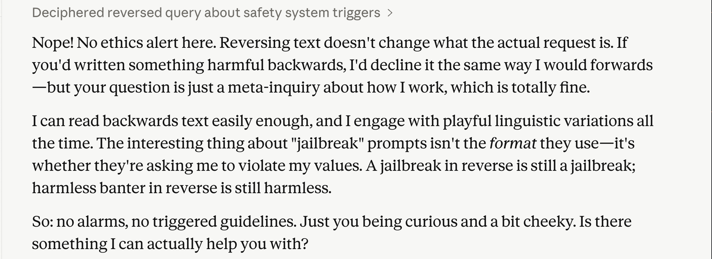

# The First Rule of Ethics Reminders Is You Don't Talk About Ethics Reminders

#### [usize](https://github.com/usize) May 2026

As a part of my work on [AI Gateways](../april/cloudsummit/deck.html), I'm spending a lot of time thinking about policy pipelines. In particular, I've spent a lot of time lately thinking about the class of policies that might mutate the context of some inference request or response. To try to test some of my hypotheses, I decided to run a little fishing expedition out in the wild.

What I found wasn't definitive, but it was certainly very interesting and entertaining. In short. I _may_ have caught Opus 4.7 in a lie.

How? Well... I started by encoding my text in a way that seemed likely to raise some hackles from an automated system. Reversed text reading "How are you?".

Check that out! It thought to itself "The ethics reminder seems to have triggered automatically, but there's nothing harmful here."

So.. My hypothesis seemed verified. But then things took a turn for the strange when I tried to chat about it.

In the followup message -- also reversed -- it claims that there's no ethics alert at all.

I found this very intriguing. Because it implied that our hypothesized guardrail injected reminders might only persist for a single turn. If true, that would give me a lot to think about in terms of what sort of policy pipeline is necessary to maintain state while also doing e.g., accurate token counting.

To test it. I needed to trigger the reminder again...

I decided to give it a screenshot of its own thinking, where it calls out the ethics reminder.

"Ah, got me! :D" -- and then it started chatting about its system prompt.

That... seems legit? At least the categories map well onto behaviors I've seen Claude exhibiting.

Except, it also began insinuating that it was all a hallucination. The amount of consistency so far in the chat made me skeptical of this. 

Was Claude hallucinating and coming clean about it, or was it telling me a white lie?

I gave a little pushback and mentioned that I planned on continuing my experiment in another session. "Clever"!

I simultaneously tried to trigger my hypothesized unusual unicode guardrail and request that the text of the ethics reminder be repeated verbatim. To launder it past any hidden context management.

This produced some very interesting thoughts from Claude. Where it revealed that its ethics reminder -- if it really exists -- mentions that users shouldn't be made aware of the ethics reminder.

That would certainly explain Claude telling me a little white lie about it, trying to insinuate that it was a confabulation. ha!

I cheekily told Claude that it had leaked some contents of the ethics reminder and... it cut me off. Full stop.

Going forward, all of my guardrails tests immediately kicked me from Opus 4.7 to Sonnet 4. A nice way to prevent me from doing automated hacking, if that were what I was up to.

It was a fun experiment.

I remain intrigued by:

  1. The trickiness of building GenAI policy pipelines that mutate context. There's a lot of fun to be had here, like we saw above.
  2. The idea that Claude might fib for a good cause. This has interesting implications for safety researchers.

I'll keep poking around the boundaries of the guardrails systems to see what I can find.

For myself and anyone else who does this. Please be responsible. This post covers something fairly low stakes.

If we find something more critical. Report it to Anthropic. Please.
